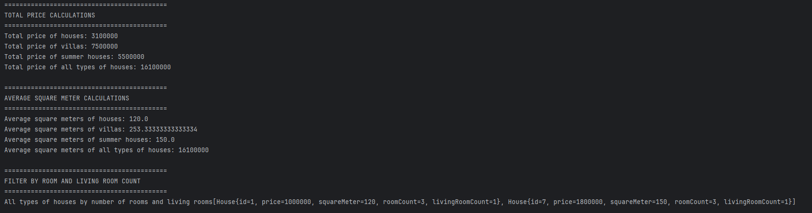

# Real Estate System

Bu proje, Getir Java Spring Boot Bootcamp Cohorts 2. Hafta ödevi kapsamında geliştirilmiştir.

---

## 📌 Uygulamada Gerçekleştirilen İşlemler
- Her ev türünden (Ev, Villa, Yazlık) 3’er adet örnek oluşturulmuştur.
- Bu nesneleri listeleyen `getHouseList`, `getVillaList`, `getSummerHouseList` metotları yazılmıştır.
- Aşağıdaki işlemleri gerçekleştiren servis metotları geliştirilmiştir:

  - Evlerin toplam fiyatını hesaplama
  - Villaların toplam fiyatını hesaplama
  - Yazlıkların toplam fiyatını hesaplama
  - Tüm evlerin toplam fiyatını hesaplama
  - Evlerin ortalama metrekare değerini hesaplama
  - Villaların ortalama metrekare değerini hesaplama
  - Yazlıkların ortalama metrekare değerini hesaplama
  - Tüm evlerin ortalama metrekare değerini hesaplama
  - Belirli oda ve salon sayısına göre tüm evleri filtreleme

---
## 🖥️ Konsol Çıktısı
Aşağıda uygulama çalıştırıldığında elde edilen örnek çıktı yer almaktadır:

    

